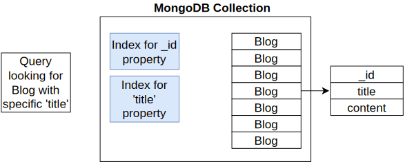

# Section 4: Data Caching with Redis

## Table of Contents

1. 

---

 

  

  

  

  

  

  

  

  

  

  

  

  

  

  

  

  

  

  

  

  

  

  

  

  

  

  

  

  

  

  

---

 
