# Section 5: Automated Headless Browser Testing

## Table of Contents

1. 

---

 

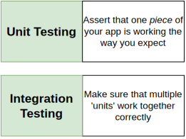
  

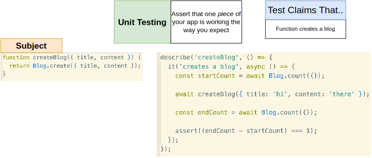
  

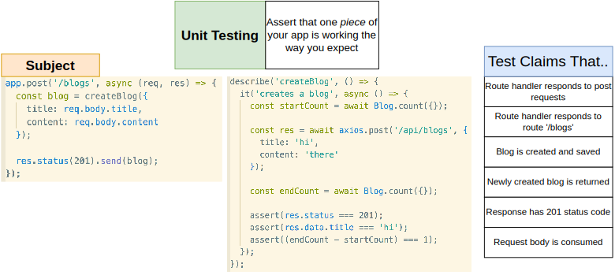
  

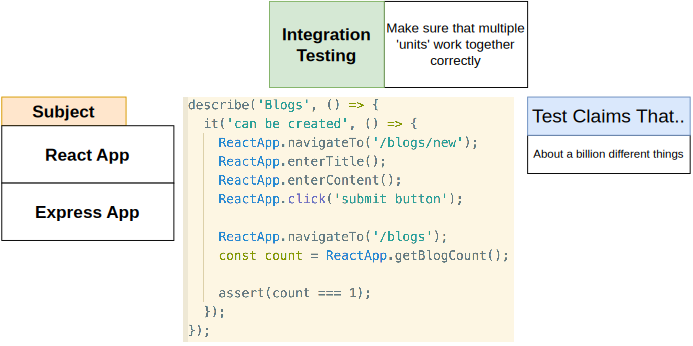
  

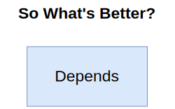
  

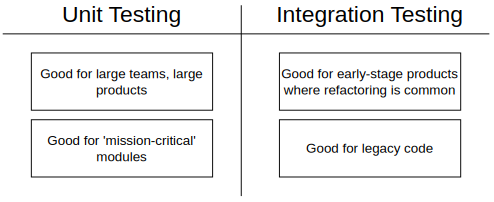
  

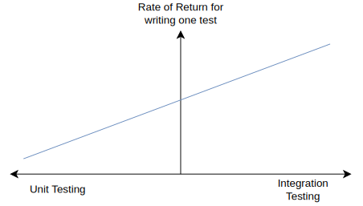
  

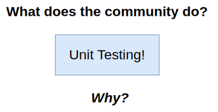
  

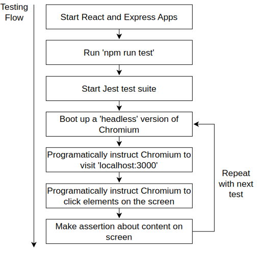
  

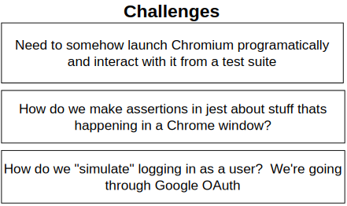
  

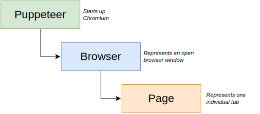
  

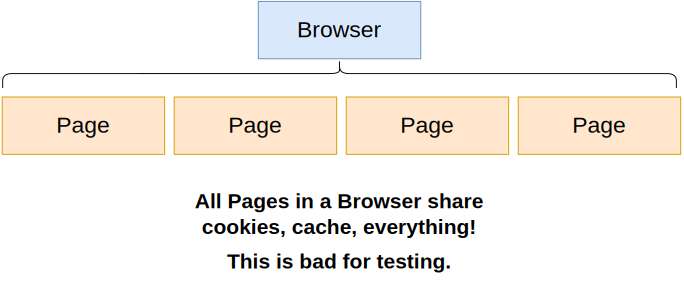
  

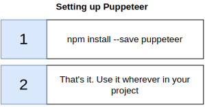
  

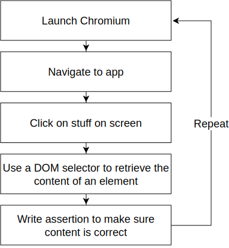
  

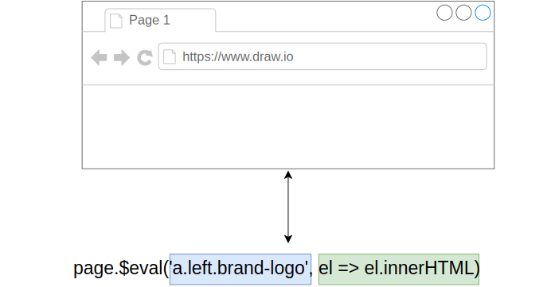
  

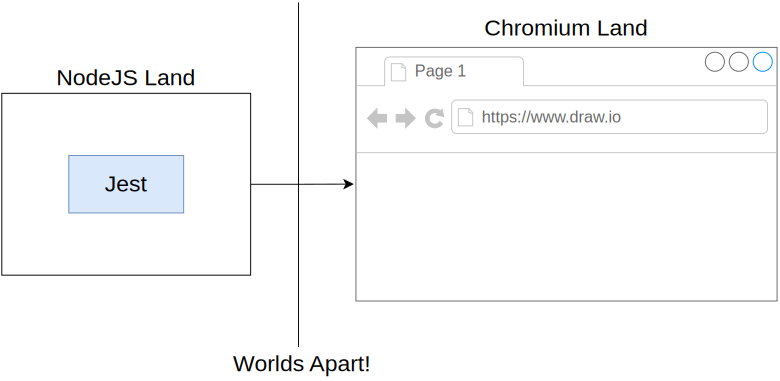
  

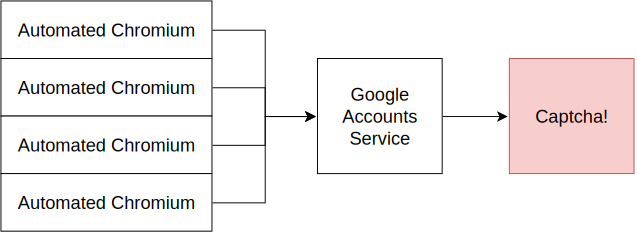
  

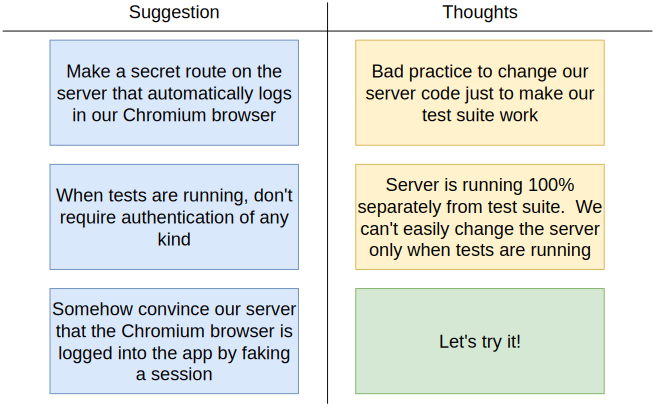
  

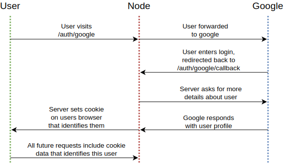
  

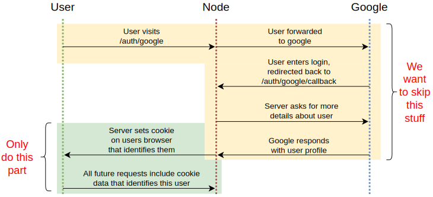
  

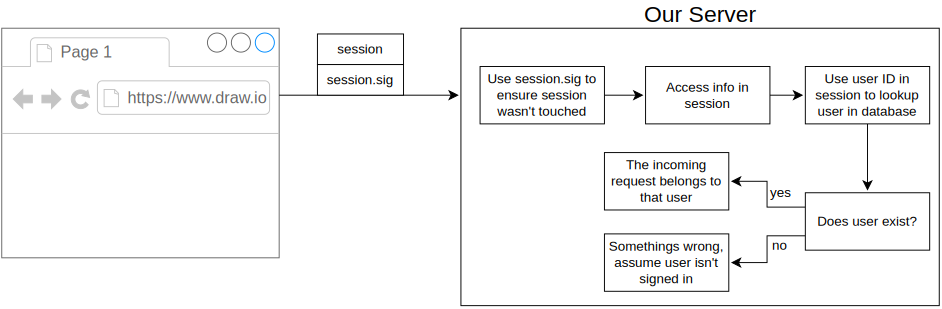
  

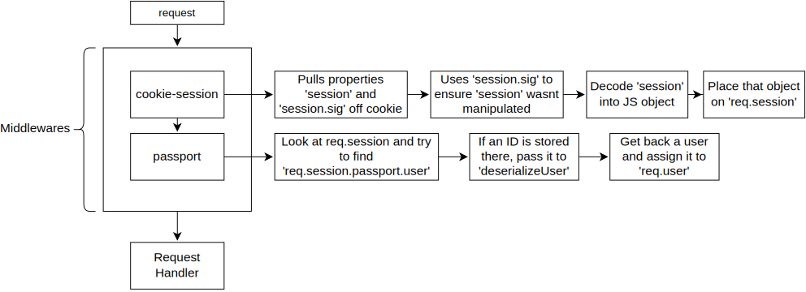
  

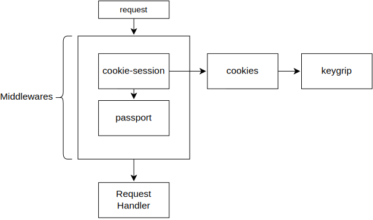
  

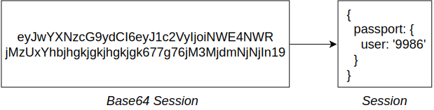
  

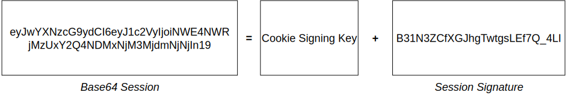
  

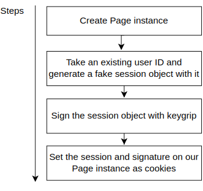
  

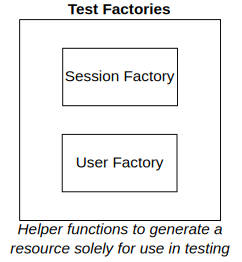
  

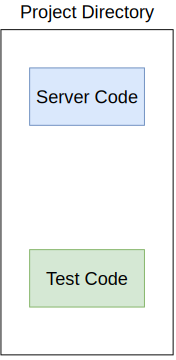
  

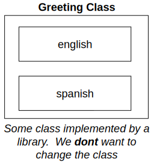
  

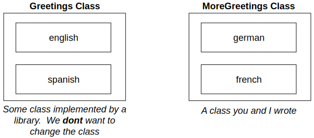
  

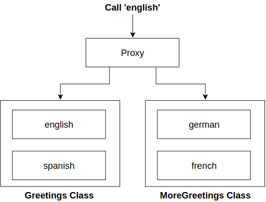
  

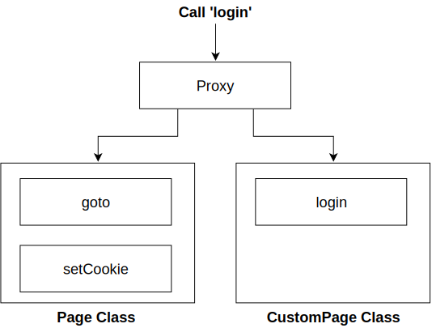
  

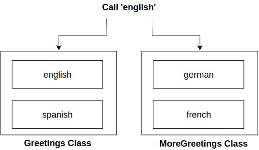
  

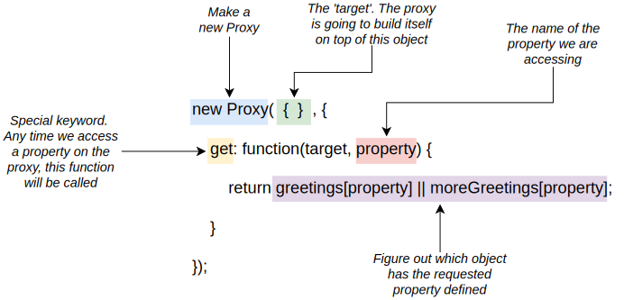
  

  

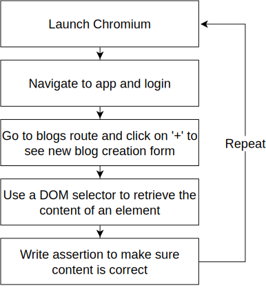
  

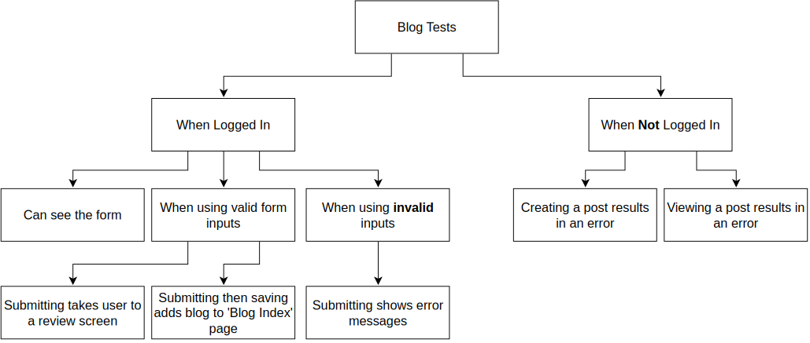
  

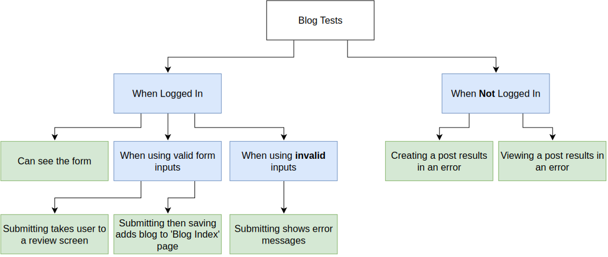
  

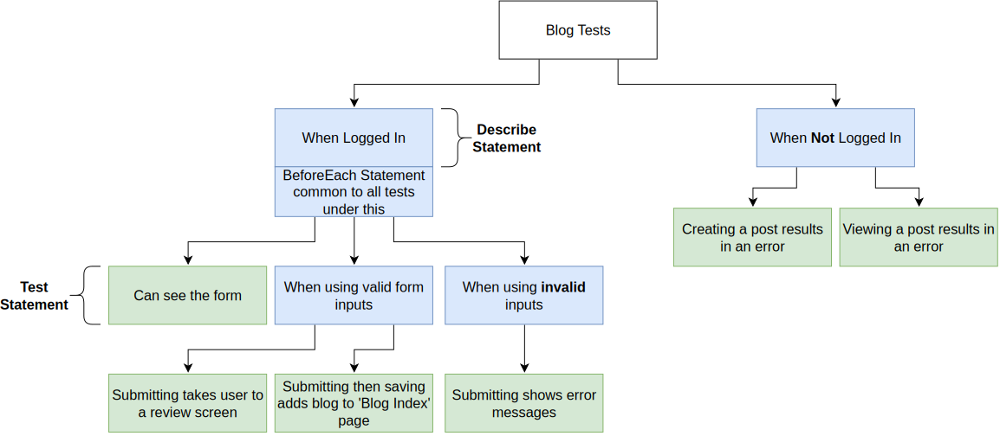
  

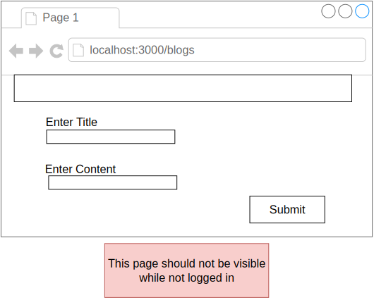
  

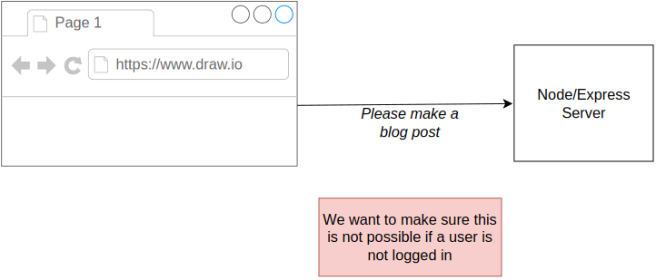
  

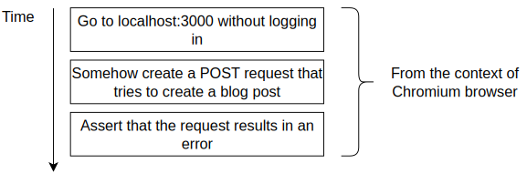
  

---

 
